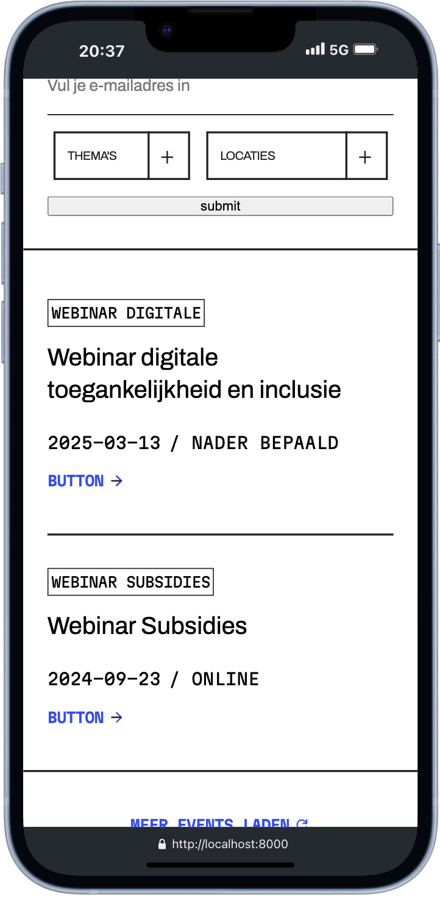

# DDA 

## Inhoudsopgave

- [DDA](#dda)
  - [Inhoudsopgave](#inhoudsopgave)
  - [Beschrijving](#beschrijving)
  - [Gebruik](#gebruik)
    - [Events](#events)
    - [Events filteren](#events-filteren)
    - [Eventdetails bekijken](#eventdetails-bekijken)
      - [Inschrijfformulier](#inschrijfformulier)
  - [Kenmerken](#kenmerken)
    - [Gebruikte technologieën](#gebruikte-technologieën)
      - [POST](#post)
  - [Mobile first](#mobile-first)
  - [Installatie](#installatie)
  - [Bronnen](#bronnen)
  - [Licentie](#licentie)

## Beschrijving
Dit project is een opdracht die ik heb ontvangen van het softwarebedrijf De Voorhoede om de website van DDA te maken en te reviseren. Het doel van deze opdracht was om de bestaande website te verbeteren aan de hand van nieuwe designs. Ook is het van belang dat er dynamische data wordt opgehaald vanuit een API of database.

In de huidige sprint 9 wordt de nadruk gelegd op het kunnen POSTEN van data in de database of API en Progressive enhancement om ervoor te zorgen dat de core functionaliteiten werken op verschillende browsers en verschillende browserversie's.

## Gebruik
De pagina is deel van een dynamische en interactieve website waar gebruikers aankomende evenementen kunnen vinden en filteren op basis van locatie en thema. De gebruiker kan vervolgens een inschrijving indienen om zich te melden voor het event.

### Events
Op eventpagina kan de gebruiker een overzicht zien van alle eventen die er zijn. Alle data van de evenementen zijn doormiddel van een GET request opgehaald uit de Directus API.

| hero-section                                             | Filter                                             |
| -------------------------------------------------------- | -------------------------------------------------- |
|  |  |

| Footer                                             | detailspagina                                         |
| -------------------------------------------------- | ----------------------------------------------------- |
|  |  |

### Events filteren
Op de eventspagina kunnen gebruikers alle opkomende events bekijken. Om dit proces makkelijker te maken voor de gebruiker zijn er filterfunctionaliteiten die filteren op locatie, thema en een combinatie van beide.

- Selecteer een locatie (bijvoorbeeld "Ermelo") en de website toont automatisch alle events die in die plaats plaatsvinden.  
- Selecteer een thema (bijvoorbeeld "Creatief") en de website toont automatisch alle events met dat thema. 
- selecteer zowel een thema (bijvoorbeeld "Creatief") als locatie (bijvoorbeeld "Ermelo") en de website toont automatisch alle events met dat thema en locatie.  

### Eventdetails bekijken
Wanneer je een events hebt gevonden dat je interesseert, kun je meer informatie bekijken door op de "Details"-button of button te klikken.  

- Je wordt doorgestuurd naar een detailpagina met uitgebreide informatie over het geselecteerde evenement.  
- Hier vind je onder andere de datum, tijd, locatie en een beschrijving van het event.  
- Een form waarmee je je kunt inschrijven voor het event.
- Een lijst van alle bedrijven die zich ingeschreven hebben voor het event.

#### Inschrijfformulier
Als de gebruiker een event heeft gevonden, kan hij zich inschrijven. Hiervoor moet de gebruiker een aantal gegevens invoeren. Alle velden behalve de "tussenvoegsel" moet worden ingevuldt om het formulier te kunnen verzenden. 

Wanneer het formulier wordt verzonden, krijgt de gebruiker visuele feedback. Dit gebeurt door middel van een geanimeerde loader en een verlaagde opacity van het formulier, waardoor het lijkt alsof het niet te gebruiken is. Zodra het formulier succesvol is verzonden, verdwijnt de loader en herstelt de opacity naar de normale waarde. De gebruiker ontvangt vervolgens een tekstueel bericht waarin wordt bevestigd dat de inschrijving succesvol is voltooid.

| Form submit                                                                         |
| ----------------------------------------------------------------------------------- |
|  |

## Kenmerken
Voor dit project heb ik gebruik gemaakt van veel moderne webtechnieken, waaronder:

### Gebruikte technologieën
- **HTML & CSS**  
  De basisstructuur en styling van de website zijn opgebouwd met HTML en CSS. De huisstijl van de website is in een aparte styleguide verwerkt.

- **Server-side JavaScript**  
  Voor de back-end is gebruik gemaakt van Node.js en Express om een dynamische en efficiënte webserver te creëren. Nodejs zorgt ervoor dat ik Javascript serverside kan gebruiken en Express maakt mogelijk om routes te maken en responses en requests te verwerken.

- **Liquid Templates**  
  De weergave van de pagina’s gebeurt met behulp van Liquid Templates, waardoor dynamische data eenvoudig kan worden ingeladen en eventueel gemanipuleerd met liquid functies.  

- **Directus APi**
  De data die wordt opgehaald kom uit de Directus Api. Doormiddel van API endpoint url's kunnen vervolgens specifieke data worden opgevraagt.

- **Nodemon**  
  Voor efficienty is er gebruik gemaakt van Nodemon tijdens de development. Dit zorgt ervoor dat de server automatisch herstart bij wijzigingen in de code.

  #### POST
  De inschrijfform op de details pagina heeft 

## Mobile first
Bij de ontwikkeling van de pagina is gewerkt volgens het mobile first-principe. Hierbij is ook rekening gehouden met de responsiveness van de typografie voor grotere schermen. Dit is gedaan door middel van CSS clamp(). Deze aanpak is verwerkt in de styleguide van de basic-styling.

## Installatie
Project lokaal installeren

1. **Fork de repository**  
   Ga naar de [repository pagina](https://github.com/Ravirkt/the-web-is-for-everyone-interactive-functionality) en klik op de **Fork** knop in de rechterbovenhoek om een kopie van de repository naar je eigen GitHub account te maken.

2. **Clone de repository**  
   Clone je geforkte repository naar je lokale computer door het volgende commando uit te voeren in de terminal: git clone https://github.com/Ravirkt/the-web-is-for-everyone-interactive-functionality

3. **Installeer de packages**  
   Voer in de terminal de command **npm install** uit om de packages uit de package.JSON te installeren.

4. **Start de server**  
   Voer in de terminal de command **npm start** uit om de server te starten.

## Bronnen

## Licentie

This project is licensed under the terms of the [MIT license](./LICENSE).
